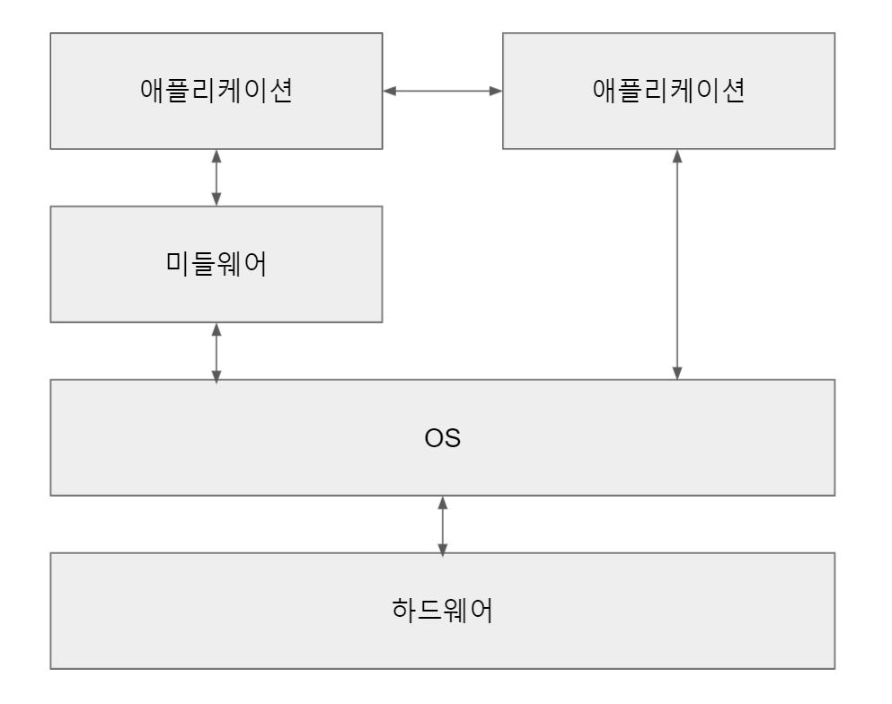
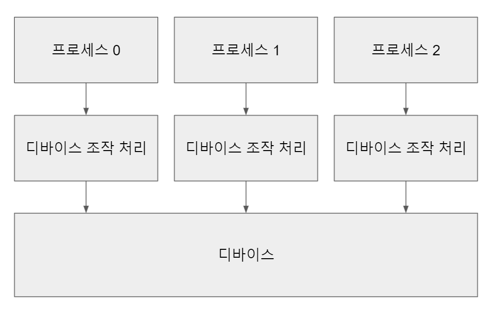
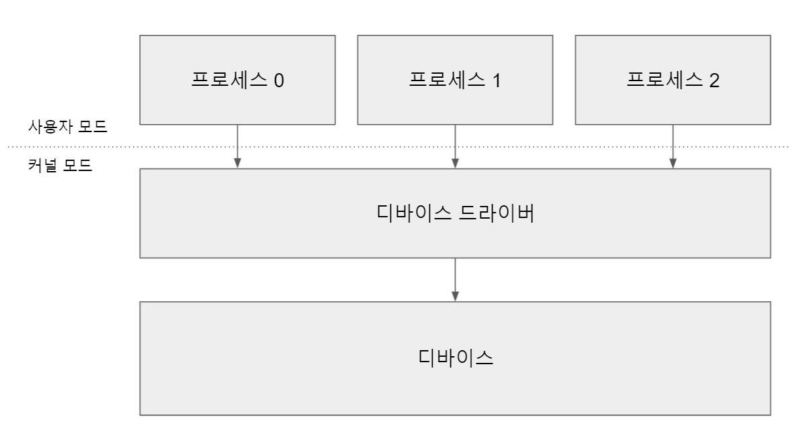
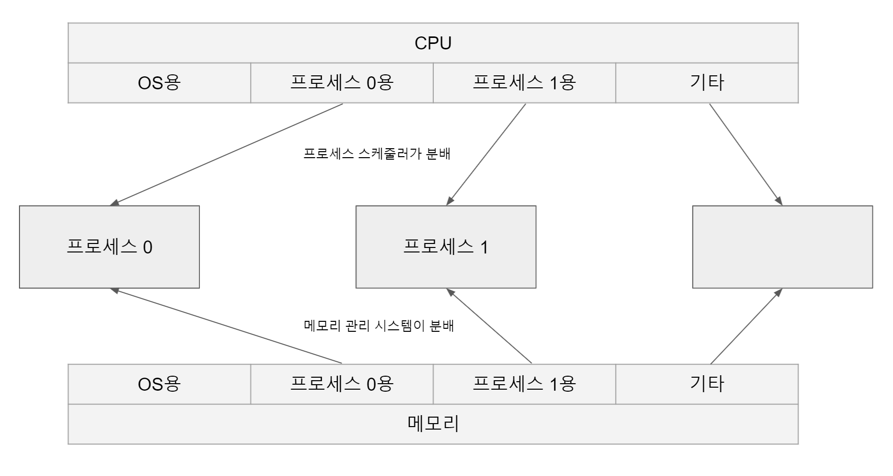
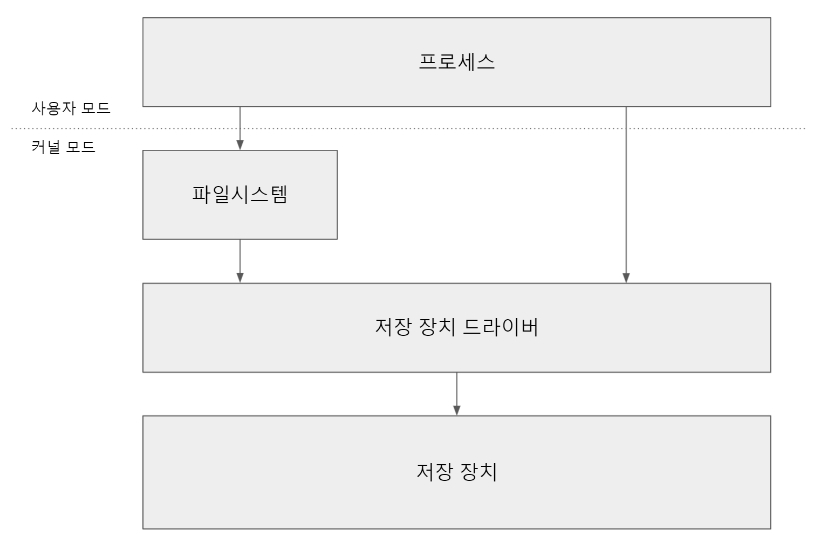

# Chapter 1. 컴퓨터 시스템의 개요

## 프로그램

- 컴퓨터 시스템이 동작할 떄 하드웨어에서 다음의 순서가 반복된다.

  - 입력 장치 또는 네트워크 어댑터를 통해 처리 요청이 들어온다.

  - 메모리의 명령을 읽어 CPU를 실행하고 결과를 다시 메모리에 기록한다.

  - 메모리의 데이터를 저장 장치에 기록하거나 네트워크를 통해 전송, 혹은 디스플레이에 출력하여 처리한다.

- 프로그램

  - 위의 과정을 반복하여 사용자에게 필요한 하나의 기능으로 정리한 것이다.

  - 종류

    
      
      - 애플리케이션 : 사용자가 직접 사용한다. 오피스 프로그램이나 스마트폰의 앱 등이 있다.

      - 미들웨어 : 여러 애플리케이션이 공통으로 사용하는 처리를 묶어서 애플리케이션의 실행을 도와준다. 웹 서버, 데이터베이스 등이 있다.

      - 운영체제(OS) : 하드웨어를 직접 조작하여 애플리케이션이나 미들웨어에 필요한 기능을 제공한다. 리눅스, 윈도우, MacOS 등이 있다.

  - 운영체제는 여러 프로그램을 프로세스라는 단위로 실행한다.

## 디바이스 드라이버

- OS가 없는 경우, 여러 프로세스가 각각 디바이스를 조작하는 코드를 작성해야 한다.

  

    - 모든 애플리케이션 개발자가 디바이스 스펙을 상세히 알아야 디바이스를 조작할 수 있다.

    - 개별 개발이므로 비용이 증가한다.

    - 여러 프로세스가 동시에 디바이스를 조작할 경우 의도치 않은 동작이 발생할 수 있다.

- 위의 단점을 해결하기 위해 리눅스는 디바이스 드라이버를 통해서만 디바이스를 조작할 수 있다. 

  

    - 여러 프로세스가 동시에 디바이스를 조작하는 상황을 방지하기 위해 프로세스가 직접 하드웨어에 접근하는 것을 차단한다.

      - CPU는 커널 모드, 유저 모드가 있으며 커널 모드로 동작할 때만 디바이스에 접근할 수 있다.

- 디바이스의 종류가 같으면 같은 인터페이스로 조작하도록 되어있다.

  ex. 입출력 장치 공통 처리, 저장 장치 공통 처리, 네트워크 어댑터 공통 처리 등

---

## 커널

- 디바이스 조작 외에도 일반적인 프로세스로 실행하면 문제가 되는 처리가 몇 가지 존재한다.

  ex. 프로세스 관리 시스템, 프로세스 스케줄링, 메모리 관리 시스템 등

  - 이러한 처리도 커널 모드에서 동작하며, 커널 모드에서 동작하는 OS의 핵심 처리를 모아 담당하는 프로그램을 커널이라고 한다.

- 시스템 콜

  - 프로세스가 커널이 제공하는 기능을 사용하려 할 때는 시스템 콜을 사용하여 커널에 요청한다.

- OS는 커널뿐만 아니라 사용자 모드에서 동작하는 다양한 프로그램을 의미한다.

- 커널은 CPU나 메모리 등의 리소스를 관리하며, 각 프로세스에 리소스를 적절히 분배한다.

  

---

## 프로세스 실행

- 프로세스 실행 시 여러 데이터가 메모리를 중심으로 CPU의 레지스터나 저장 장치 같은 기억장치 사이에서 전송된다.

  - 기억장치 계층이라고 불리는 계층 구조가 있으며, 각 계층은 크기나 가격, 전송 속도에서 장단점이 있다.

- 저장 장치에 보관된 데이터는 디바이스 드라이버에 직접 요청해서 접근하기 보다는 파일시스템이라고 하는 프로그램을 통해 접근한다.

  

- 시스템이 작동하려면 저장 장치에서 OS에 대한 정보를 읽어야 한다.

---

### 참고

- [실습과 그림으로 배우는 리눅스 구조 - 타케우치 사토루](https://www.aladin.co.kr/shop/wproduct.aspx?ItemId=181554153)
