# Chapter 4. 프로세스 스케줄러

- 프로세스 스케줄러는 여러 프로세스를 타임 슬라이스 방식으로 번갈아 처리한다.

  - CPU는 한번에 하나의 프로세스만 처리할 수 있다.

- 시스템에서 CPU로 인식하는 것을 논리 CPU라고 하며, 하이퍼스레딩이 적용된 경우 각 하이퍼스레드가 논리 CPU로 인식된다.

---

## 테스트 프로그램으로 작동 방식 확인하기

- 알고자 하는 정보

  - 논리 CPU가 특정 시점에 어떤 프로세스를 실행 중인가

  - 각 프로세스의 진행률

- 테스트 프로그램 사양

  - 명령어 라인 파라미터(nproc, total, resolution)

    |파라미터|설명|
    |:-:|:-:|
    |nproc|동시 동작 프로세스 수|
    |total|프로그램이 동작하는 총 시간\[ms\]|
    |resolution|데이터 수집 시간 간격\[ms\]|

  - 각 프로세스의 동작 방식

    - CPU 시간을 total 밀리초만큼 사용한 후 종료한다.

    - CPU 시간을 resolution 밀리초만큼 사용할 때마다 다음 내용을 출력한다.

      ```sh
      프로세스고유ID(0 ~ nproc-1)   프로그램시작시점부터경과한시간   진행도[%]
      ```

### 테스트 프로그램 컴파일

```sh
$ gcc -o output/sched src/sched.c
```

---

## 실험 1

- 모든 프로세스가 **1개의 논리 CPU에서만 동작**하게 하여 스케줄러의 동작을 확인한다.

  - 아래 형식처럼 **taskset** 명령어의 **-c** 옵션으로 논리 CPU를 지정할 수 있다.

    ```sh
    $ taskset -c 0 ./sched nproc total resolution
    ```

- 프로세스의 개수를 3가지 경우(1개, 2개, 4개)로 나눠서 결과를 측정할 것이다.

### 결과를 파일로 저장

- 프로세스 1개를 100ms동안 1ms 정밀도로 측정하며 동작시킨다.

  ```sh
  $ taskset -c 0 output/sched 1 100 1
  0       1       1
  0       1       2
  0       2       3
  ...
  0       92      99
  0       93      100
  ```

- 결과를 그래프로 보기 위해서, 다음과 같이 파일로 저장한다.

  ```sh
  $ taskset -c 0 output/sched 1 100 1 > log/1core-1process.log
  $ taskset -c 0 output/sched 2 100 1 > log/1core-2process.log
  $ taskset -c 0 output/sched 4 100 1 > log/1core-4process.log
  ```

### 프로세스 개수에 따른 진행도 시각화

- [gnuplot](gnuplot.md) 툴을 이용하여 각 결과를 그래픽으로 확인할 수 있다.

  ```sh
  $ gnuplot plot/1core-1process.gnu
  $ gnuplot plot/1core-2process.gnu
  $ gnuplot plot/1core-4process.gnu
  ```

- 1코어 1프로세스

  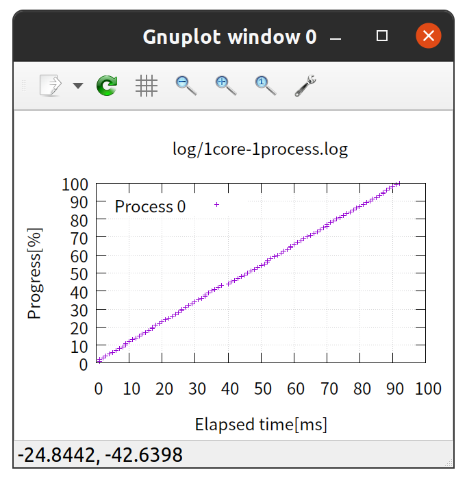

    - 프로세스 1개가 코어를 독점하므로 선형적인 그래프가 나온다.

- 1코어 2프로세스

  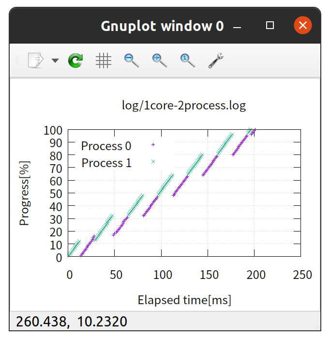

    - 2개의 프로세스가 타임 슬라이스 방식으로 진행되는 것을 볼 수 있다.

- 1코어 4프로세스

  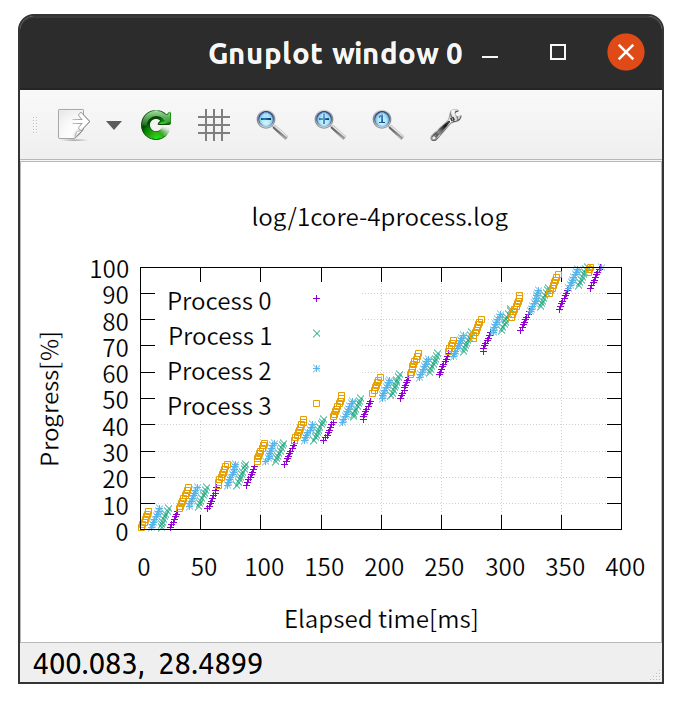

    - 4개의 프로세스가 타임 슬라이스 방식으로 진행되는 것을 볼 수 있다.

### 논리 CPU의 타임 슬라이스 시각화

- 1코어 1프로세스

  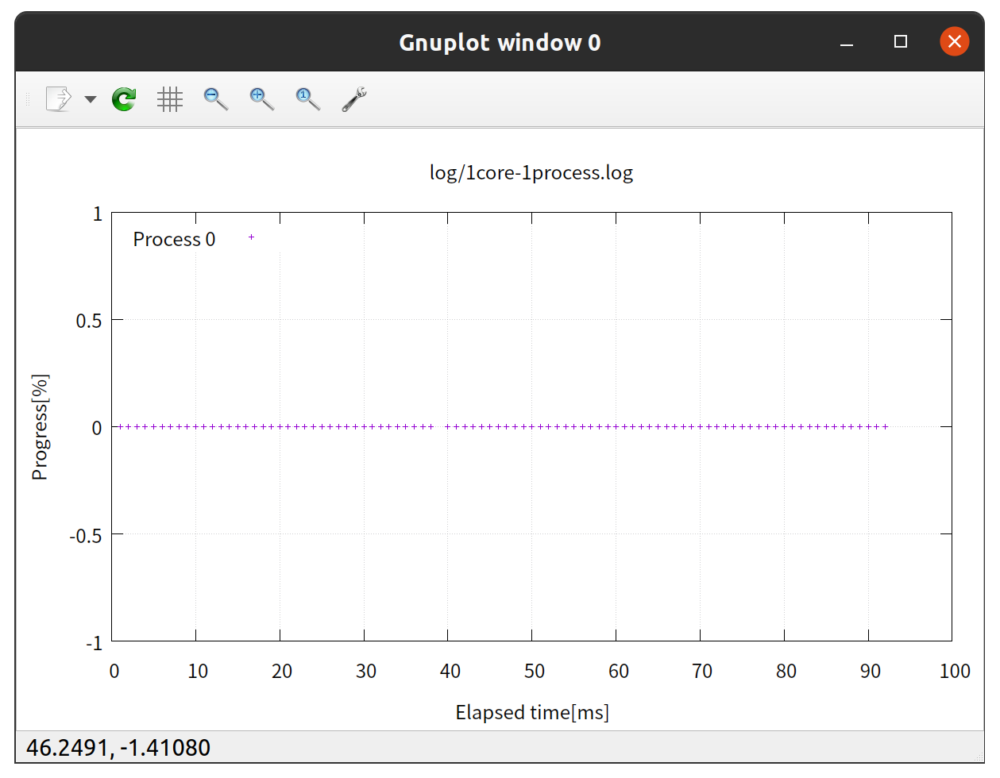

    - 프로세스 1개가 코어를 독점하는 것을 볼 수 있다.

- 1코어 2프로세스

  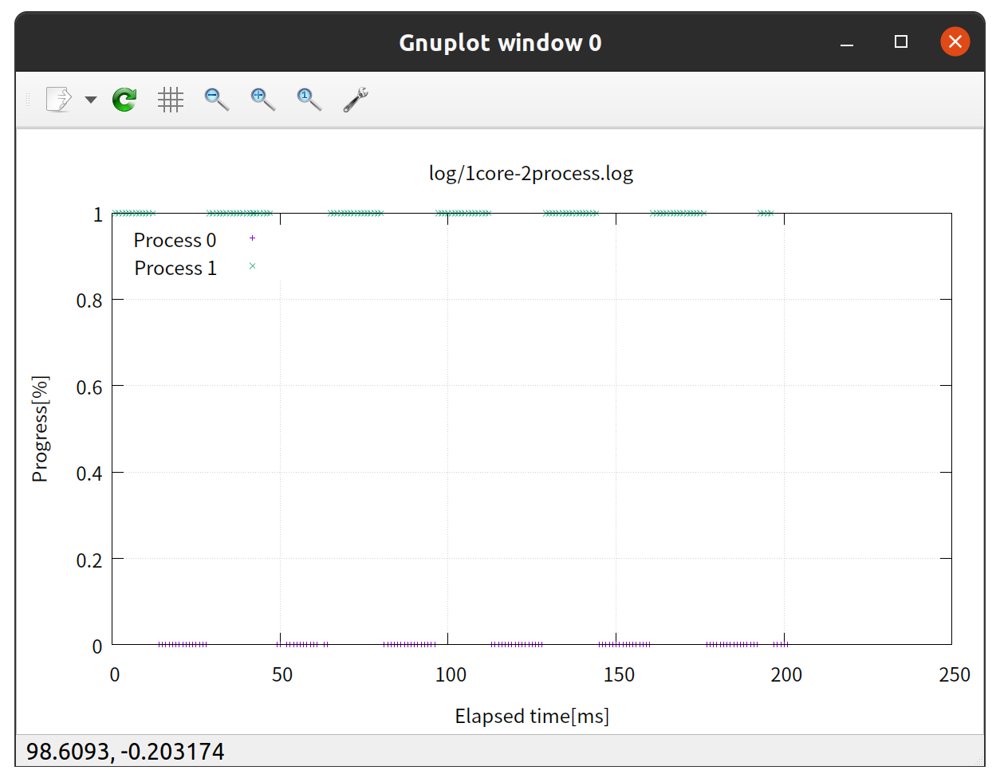

    - 2개의 프로세스가 동시에 처리되지 않고 타임 슬라이스 방식으로 진행되는 것을 볼 수 있다.

- 1코어 4프로세스

  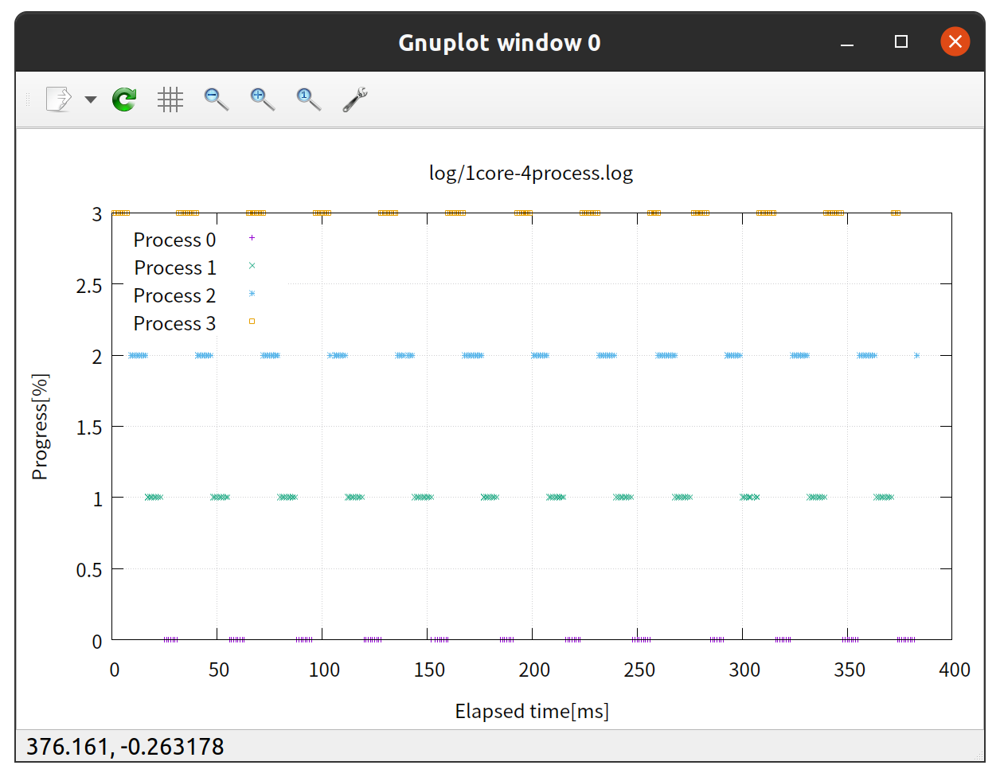

    - 4개의 프로세스가 타임 슬라이스 방식으로 진행되는 것을 볼 수 있다.

### 실험 1 고찰

- 위의 결과를 통해 다음 사실을 알 수 있다.

  - 각 프로세스는 논리 CPU를 사용하는 동안에만 진행된다.

  - 특정 순간에 논리 CPU에서 동작되는 프로세스는 1개이다.

  - 총 소요 시간은 프로세스 수에 비례한다.

  - 각 프로세스는 대략 같은 양의 타임 슬라이스를 가진다. (라운드 로빈)

---

## 컨텍스트 스위치(Context switch)

- 논리 CPU 상에서 동작 중인 프로세스를 바꾸는 것을 컨텍스트 스위치라고 한다.

- 위의 프로세스 4개짜리 그래프에서, 논리 CPU에서 동작 중인 프로세스가 계속 변하는 것을 볼 수 있고, 이 때마다(타임 슬라이스 타이밍) 컨텍스트 스위치가 발생하는 것이다.

- 프로세스가 어떤 함수를 수행 중이더라도 타임 슬라이스를 모두 소비하면 컨텍스트 스위치가 발생한다.

---

## 프로세스의 상태

### 실행 중인 프로세스 확인

- `ps ax` 명령어로 현재 시스템에 존재하는 프로세스를 출력할 수 있다.

  ```sh
  $ ps ax | wc -l
  274    # 프로세스 개수
  ```

    - `|` 기호는 파이프이며, 앞의 출력 결과를 뒤에 있는 명령어의 입력으로 넘긴다.

    - `wc -l` 명령어는 라인의 수를 출력한다.

- 앞의 실험에서 sched 프로세스가 진행 중일 때, 다른 프로세스들은 대부분 슬립 상태였다.

- 프로세스의 상태

  |상태|의미|
  |:-:|:-:|
  |실행 상태|논리 CPU를 사용 중인 상태|
  |실행 대기 상태|CPU 시간이 할당되기를 기다리는 상태|
  |슬립 상태|이벤트 발생을 기다리는 상태. CPU 시간 사용 X|
  |좀비 상태|프로세스 종료 후 부모 프로세스가 종료 상태를 인식할 때까지 대기하는 상태|

    - 이벤트 예시

      - 대기하도록 정해진 시간이 경과

      - 키보드나 마우스, HDD나 SSD 등의 I/O 이벤트

      - 네트워크 송수신 종료

- 상태 직접 확인

  - `ps ax` 명령어의 결과 중 3번째 필드인 **STAT** 의 첫 문자를 통해 상태를 알 수 있다.

    |STAT 필드 첫 문자|상태|
    |:-:|:-:|
    |R|실행(Run) or 실행 대기(Ready)|
    |S or D|슬립 상태. 시그널에 따라 실행 상태도 되돌아 오는 것이 S, 저장 장치 접근 대기 등이 D|
    |Z|좀비 상태|
    |I|Idle 상태|

    - D 상태가 오래 지속된다면 스토리지의 I/O가 종료되지 않은 상태이거나, 커널에 문제가 있다는 것을 의미한다.

  ```sh
  $ ps ax
    PID TTY      STAT   TIME COMMAND
      1 ?        Ss     0:01 /sbin/init splash
      2 ?        S      0:00 [kthreadd]
      3 ?        I<     0:00 [rcu_gp]
      4 ?        I<     0:00 [rcu_par_gp]
      6 ?        I<     0:00 [kworker/0:0H-events_highpri]
      9 ?        I<     0:00 [mm_percpu_wq]
     10 ?        S      0:00 [rcu_tasks_rude_]
     11 ?        S      0:00 [rcu_tasks_trace]
     12 ?        S      0:00 [ksoftirqd/0]
     13 ?        I      0:20 [rcu_sched]
     14 ?        S      0:00 [migration/0]
     15 ?        S      0:00 [idle_inject/0]
     16 ?        S      0:00 [cpuhp/0]
     ...
  ```

### 프로세스의 상태 변화

- 프로세스의 상태도는 운영체제마다, 버전마다 다른 것 같다. 다음은 [위키피디아](https://en.wikipedia.org/wiki/Process_state)의 그림이다.

  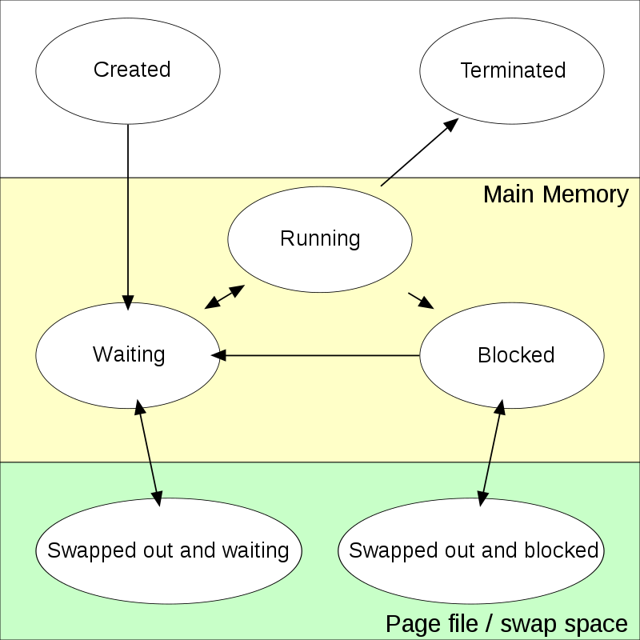

    - 프로세스는 생성부터 종료까지 여러 상태로 변화하며 진행된다.

- 실험 1의 1core-1process 는 해당 프로세스가 논리 CPU를 거의 독점하기 때문에 슬립이 없다고 할 수 있다.

- 실험 1의 1core-2process 는 2개의 프로세스가 번갈아서 CPU 시간이 할당되기를 기다리므로, 실행 상태와 실행 대기 상태를 왔다갔다한다.

### idle 상태

- 논리 CPU에서 아무 프로세스도 동작하지 않으면, idle 프로세스라고 하는 "아무 것도 하지 않는" 프로세스가 동작한다.

  - 무한루프처럼 무언가를 계속 반복하는 것은 아니고, CPU의 특수한 명령을 이용하여 CPU를 휴식 상태로 만들어서 실행 가능한 프로세스가 있을 떄까지 소비 전력을 낮춘다.

  - 스마트폰의 배터리가 오래 가는 이유도 CPU가 이 idle 상태로 오래 있는 덕분이다.

- sar 명령어를 통해 논리 CPU가 얼마나 idle 상태에 있는지 알 수 있다.

  ```sh
  $ sar -P ALL 1
  Linux 5.11.0-27-generic (ubun2-Surface-Pro-7) 	2021년 09월 08일 	_x86_64_(8 CPU)

  20시 23분 48초     CPU     %user     %nice   %system   %iowait    %steal     %idle
  20시 23분 49초     all      2.14      0.00      0.75      0.00      0.00     97.11
  20시 23분 49초       0      3.00      0.00      1.00      0.00      0.00     96.00
  20시 23분 49초       1      0.00      0.00      0.00      0.00      0.00    100.00
  20시 23분 49초       2      2.00      0.00      1.00      0.00      0.00     97.00
  20시 23분 49초       3      1.01      0.00      1.01      0.00      0.00     97.98
  20시 23분 49초       4      4.90      0.00      0.98      0.00      0.00     94.12
  20시 23분 49초       5      1.01      0.00      0.00      0.00      0.00     98.99
  20시 23분 49초       6      3.03      0.00      1.01      0.00      0.00     95.96
  20시 23분 49초       7      2.00      0.00      1.00      0.00      0.00     97.00
  ```

    - %idle이 대부분 거의 100인 것을 보아, 현재 시스템 전체가 CPU를 거의 사용하지 않음을 알 수 있다.

- 무한 루프 실행 후 확인

  - 논리 CPU 0번에서 *loop.py* 스크립트를 실행하고 확인해보면 다음과 같다.

    ```sh
    $ taskset -c 0 python src/loop.py &
    [1] 37983
    $ sar -P ALL 1 1                   
    Linux 5.11.0-27-generic (ubun2-Surface-Pro-7) 	2021년 09월 08일 	_x86_64_	(8 CPU)

    20시 29분 05초     CPU     %user     %nice   %system   %iowait    %steal     %idle
    20시 29분 06초     all      0.38     12.56      0.00      0.00      0.00     87.06
    20시 29분 06초       0      0.00    100.00      0.00      0.00      0.00      0.00 # 여기
    20시 29분 06초       1      1.01      0.00      0.00      0.00      0.00     98.99
    20시 29분 06초       2      0.00      0.00      0.00      0.00      0.00    100.00
    20시 29분 06초       3      0.00      0.00      0.00      0.00      0.00    100.00
    20시 29분 06초       4      1.00      0.00      0.00      0.00      0.00     99.00
    20시 29분 06초       5      0.99      0.00      0.00      0.00      0.00     99.01
    20시 29분 06초       6      0.00      0.00      0.00      0.00      0.00    100.00
    20시 29분 06초       7      0.00      0.00      0.00      0.00      0.00    100.00
    ...
    $ kill 37983
    [1]  + 37983 terminated  taskset -c 0 python src/loop.py 
    ```

      - 결과를 보면 CPU 0번에서 %idle의 값이 0임을 볼 수 있다.

---

## 스루풋, 레이턴시

- 논리 CPU에서 스루풋과 레이턴시는 다음을 의미한다.

  - 스루풋<sub>throughput</sub> = 완료한 프로세스의 수 / 경과 시간

    - 단위 시간 당 처리된 일의 양
  
  - 레이턴시<sub>latency</sub> = 처리 종료 시간 - 처리 시작 시간

    - 각 처리의 시작부터 종료까지 경과된 시간

### 예시

- 1초 동안 프로세스 1개의 처리를 끝내는 경우

  - 논리 CPU의 경과 시간 중 40%가 idle 상태라고 가정하면 다음 그림과 같다.

    

      - 일단 1개의 프로세스를 1초만에 끝냈으므로 스루풋은 **1프로세스 / 1초** 이다. 

  - 처음에 시간 차를 두고 2개의 프로세스를 실행하면 이상적인 조건에서 다음과 같이 동작할 수 있다.

    

      - 이 경우 2개의 프로세스를 1.2초만에 끝냈으므로, 스루풋은 **1.67프로세스 / 1초** 이다.

  - 즉 idle 상태가 최소일 때 스루풋이 최대가 된다.

### 실험 1 고찰 - 스루풋, 레이턴시

- 1core-1process

  - 스루풋
  
    - 1개의 프로세스를 100ms동안 처리하므로, 스루풋은 **10프로세스 / 1초** 이다.

  - 평균 레이턴시

    - 처리의 시작부터 종료까지 약 100ms가 걸리므로 **100ms**라고 할 수 있다.

- 1core-2process

  - 스루풋

    - 2개의 프로세스를 200ms동안 처리하므로, 스루풋은 위와 같은 **10프로세스 / 1초** 이다.

  - 평균 레이턴시

    - **200ms**

- 1core-4process

  - 스루풋

    - **4프로세스 / 400ms** == **10프로세스 / 1초**

  - 평균 레이턴시

    - **400ms**

- 이를 표로 나타내면 다음과 같다.

  |프로세스 개수|스루풋\[프로세스 / 초\]|레이턴시\[ms\]|
  |:-:|:-:|:-:|
  |1|10|100|
  |2|10|200|
  |4|10|400|

- 결론

  - 이론상 논리 CPU가 idle 상태로 변하지 않는 경우, 스루풋은 동일하다. 

    - 오히려 컨텍스트 스위치의 오버헤드로 인해 더 느려진다.

  - 프로세스 개수를 늘리면 레이턴시는 증가한다.

  - 각 프로세스의 평균 레이턴시는 비슷하다.

    - 타임 슬라이스 방식으로 프로세스를 진행시키기 때문이다.

### 실제 시스템

- 실제 시스템에서 논리 CPU는 다음의 상태를 엄청나게 반복하며 전환한다.

  - idle : 논리 CPU가 쉬는 상태이므로 스루풋이 떨어진다.

  - 프로세스 동작 중 : 프로세스를 실행 중이므로 이상적인 상태지만, 다른 프로세스가 실행 대기 상태이면 여러 프로세스의 레이턴시가 증가한다. (타임 슬라이스 방식으로 작업을 나누기 때문에)

  - 프로세스 대기 중 : 실행 대기 중인 프로세스가 존재하는 상태이므로 스루풋은 높지만, 프로세스들의 레이턴시가 길어진다.

- 실제 시스템을 설계할 때는 스루풋과 레이턴시의 목표치를 정한 뒤 시스템을 튜닝한다고 한다.

- 실행 중, 실행 대기 중인 프로세스 확인

  - sar 명령어의 **-q** 옵션을 이용하여 **runq-sz** 필드를 통해 확인할 수 있다.

    ```sh
    $ sar -q 1 1
    Linux 5.13.13-surface (ubun2-Surface-Pro-7) 	2021년 09월 10일 	_x86_64_(8 CPU)

    02시 21분 57초   runq-sz  plist-sz   ldavg-1   ldavg-5  ldavg-15   blocked
    02시 21분 58초         0       861      0.48      0.47      0.40         0
    평균값:          0       861      0.48      0.47      0.40         0
    $ taskset -c 0 python src/loop.py &
    [1] 5915
    $ sar -q 1 1
    Linux 5.13.13-surface (ubun2-Surface-Pro-7) 	2021년 09월 10일 	_x86_64_(8 CPU)

    02시 22분 13초   runq-sz  plist-sz   ldavg-1   ldavg-5  ldavg-15   blocked
    02시 22분 14초         1       851      0.37      0.44      0.39         0
    평균값:          1       851      0.37      0.44      0.39         0
    $ taskset -c 0 python src/loop.py &
    [2] 5968
    $ sar -q 1 1
    Linux 5.13.13-surface (ubun2-Surface-Pro-7) 	2021년 09월 10일 	_x86_64_(8 CPU)

    02시 22분 18초   runq-sz  plist-sz   ldavg-1   ldavg-5  ldavg-15   blocked
    02시 22분 19초         2       852      0.42      0.45      0.39         0
    평균값:          2       852      0.42      0.45      0.39         0
    $ kill 5915 5968
    [1]  - 5915 terminated  taskset -c 0 python src/loop.py                         
    [2]  + 5968 terminated  taskset -c 0 python src/loop.py
    ```

---

## 실험 2

- 모든 프로세스가 **2개의 논리 CPU에서 동작**하게 하여 스케줄러의 동작을 확인한다.

### 로드밸런서<sub>load balancer</sub>

- 여러 개의 논리 CPU에 공평하게 프로세스를 분배하는, 스케줄러 안에서 동작하는 기능이다.

  - 글로벌 스케줄러<sub>global scheduler</sub>라고도 한다.

### 결과를 파일로 저장

- 먼저 논리 CPU의 개수를 알아야 적절한 논리 CPU 번호를 고를 수 있다.

  ```sh
  $ grep -c processor /proc/cpuinfo
  8
  ```

- 8개의 논리 CPU가 존재한다면, 실험에는 CPU 0과 CPU 4가 적절하다.

  - 이 2개의 논리 CPU는 캐시 메모리를 공유하고 있지 않는 등 서로 독립성이 높기 때문에, 보다 정확한 실험 결과를 도출할 수 있다.

  - 만약 하이퍼스레드가 적용된 환경인데 논리 CPU가 2개라면, 사실 1코어에서 실행되는 것이므로 결과가 부적절할 수 있다.

- 논리 CPU 2개를 사용하며, 프로세스가 1개, 2개, 4개일 때의 결과를 파일로 저장한다.

  ```sh
  $ taskset -c 0,4 output/sched 1 100 1 > log/2core-1process.log
  $ taskset -c 0,4 output/sched 2 100 1 > log/2core-2process.log
  $ taskset -c 0,4 output/sched 4 100 1 > log/2core-4process.log
  ```

### 프로세스 개수에 따른 진행도 시각화

- 위와 마찬가지로 gnuplot을 사용해 그래프로 표현한다.

  ```sh
  $ gnuplot plot/2core-1process.gnu
  $ gnuplot plot/2core-2process.gnu
  $ gnuplot plot/2core-4process.gnu
  ```

- 2코어 1프로세스


  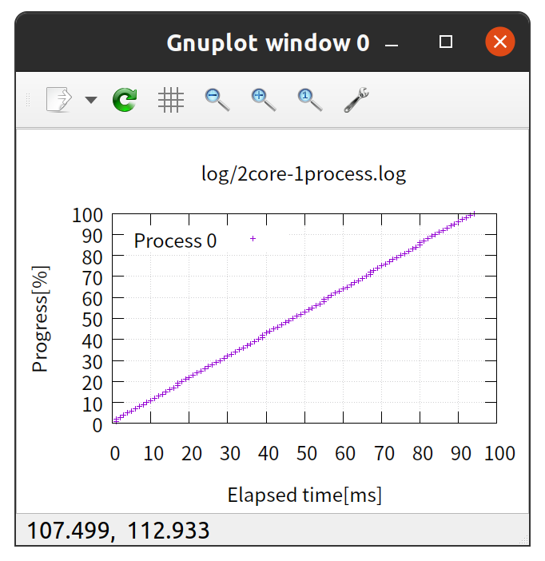

    - 프로세스 1개가 코어를 독점하므로 선형적인 그래프가 나온다.

- 2코어 2프로세스

  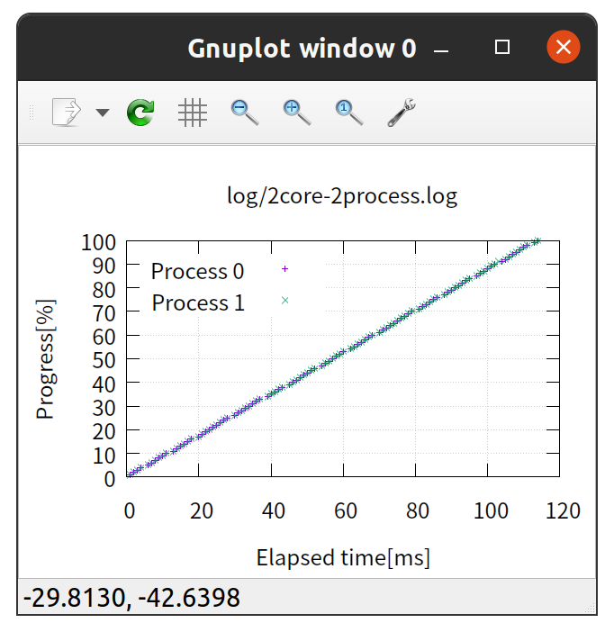

    - 2개의 프로세스가 2개의 논리 CPU를 하나씩 독점해서 사용하므로 위의 경우와 비슷한 것을 알 수 있다.

- 2코어 4프로세스

  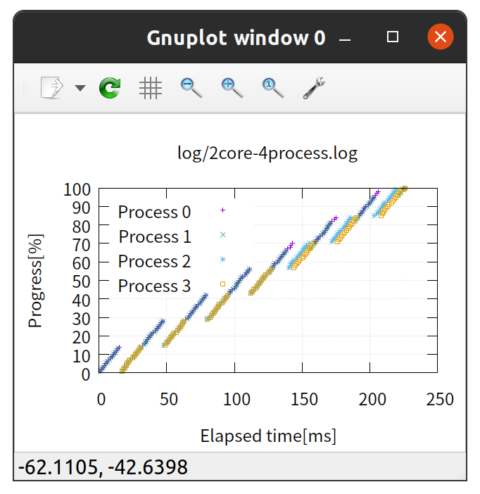

    - 2개의 논리 CPU에 각 2개의 프로세스가 번갈아가며 동작하는 것을 볼 수 있다.

### 논리 CPU의 타임 슬라이스 시각화

- 2코어 1프로세스

  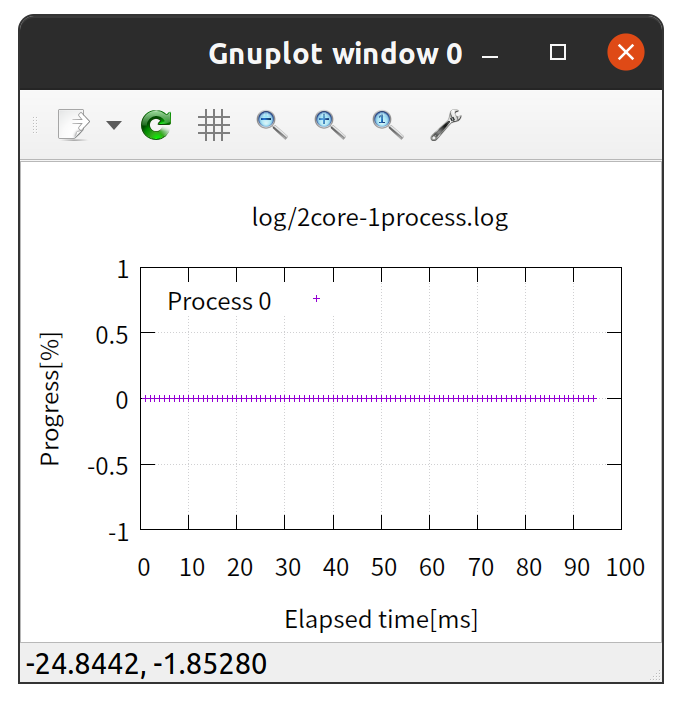

    - 프로세스 1개가 코어를 독점하는 것을 볼 수 있다.

- 2코어 2프로세스

  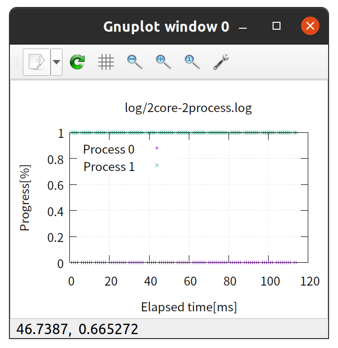

    - 2개의 프로세스가 2개의 논리 CPU를 독점한다.

- 2코어 4프로세스

  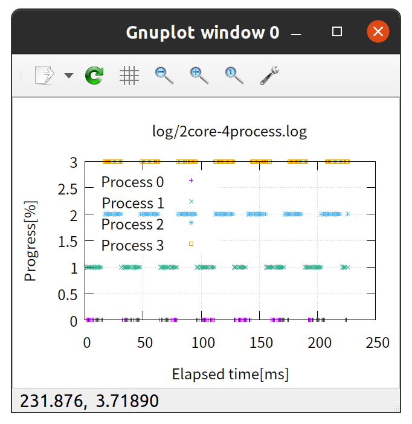

    - 4개의 프로세스가 2개씩 타임 슬라이스 방식으로 진행되는 것을 볼 수 있다.

### 실험 2 스루풋, 레이턴시

- 프로세스가 증가하면 경과 시간이 100ms를 조금씩 넘는데, 단순화를 위해 100ms로 계산했다. 책에서는 대략 100 +- 10 ms 로 나온걸 보니 내 코드를 좀 수정해야 할 것 같다.

- 2core-1process

  - 스루풋
  
    - 1개의 프로세스를 100ms동안 처리하므로, 스루풋은 **10프로세스 / 1초** 이다.

  - 평균 레이턴시

    - 처리의 시작부터 종료까지 약 100ms가 걸리므로 **100ms**라고 할 수 있다.

- 2core-2process

  - 스루풋

    - 2개의 프로세스를 100ms동안 처리하므로, 스루풋은 위와 같은 **20프로세스 / 1초** 이다.

  - 평균 레이턴시

    - **100ms**

- 2core-4process

  - 스루풋

    - **4프로세스 / 200ms** == **20프로세스 / 1초**

  - 평균 레이턴시

    - **200ms**

- 이를 표로 나타내면 다음과 같다.

  |프로세스 개수|스루풋\[프로세스 / 초\]|레이턴시\[ms\]|
  |:-:|:-:|:-:|
  |1|10|100|
  |2|20|100|
  |4|20|200|

### 실험 2 고찰

- 1개의 논리 CPU에서 동시에 처리되는 프로세스의 수는 1개이다.

- 여러 프로세스가 실행 가능한 경우, 타임 슬라이스를 이용해 각 프로세스를 CPU에 순차적으로 할당한다.

- 멀티코어 CPU 환경에서는 여러 프로세스를 동시에 동작시켜야 스루풋이 증가한다.

  - 실행 가능한 프로세스 수가 논리 CPU보다 많아지면 스루풋은 더 이상 오르지 않고, 레이턴시가 증가한다.

---

## 경과 시간과 사용 시간

### time 명령어

time 명령어를 통해 프로세스를 동작시키면 경과 시간과 사용 시간 두 가지 수치를 알 수 있다.

- 경과 시간 : 프로세스의 실행 시작 시간부터 실행 종료 시간까지의 경과 시간을 나타낸다.

- 사용 시간 : 프로세스가 실제로 논리 CPU를 사용한 시간을 의미한다.

  - 즉 프로세스가 "실행 상태"인 구간의 시간을 합친 값이다.

bash와 zsh의 출력 형식이 약간 다르다.

  - bash

    ```sh
    real  경과시간
    user  유저모드_CPU동작시간
    sys   커널모드_CPU동작시간
    ```

  - zsh

    ```sh
    %J  %U user %S system %P cpu %*E total
    작동명령어 유저모드_CPU동작시간 user 커널모드_CPU동작시간 system CPU사용량[%] cpu 경과시간 total
    ```

      - CPU 사용량은 100*(%U+%S)/%E 으로 계산된다.

      - time 매뉴얼에 **-p** 옵션을 붙이면 bash의 결과와 같은 형식으로 나온다는데 왜 안되지..

      - *.zshrc* 파일을 수정하여 형식을 변경할 수도 있다고 한다.

        <https://unix.stackexchange.com/questions/453338/how-to-get-execution-millisecond-time-of-a-command-in-zsh>

### 실제 측정

- 오차를 최소화하기 위해 실행 시간을 10초로 설정한다.

  ```sh
  $ time taskset -c 0 output/sched 1 10000 10000
  0       9410    100
  taskset -c 0 output/sched 1 10000 10000  11.68s user 0.00s system 99% cpu 11.677 total
  $ time taskset -c 0 output/sched 2 10000 10000
  1       18740   100
  0       18769   100
  taskset -c 0 output/sched 2 10000 10000  20.99s user 0.00s system 99% cpu 20.992 total
  $ time taskset -c 0 output/sched 4 10000 10000
  3       36168   100
  1       36183   100
  2       36213   100
  0       36242   100
  taskset -c 0 output/sched 4 10000 10000  38.54s user 0.00s system 99% cpu 38.547 total
  $ time taskset -c 0,4 output/sched 1 10000 10000
  0       9188    100
  taskset -c 0,4 output/sched 1 10000 10000  11.42s user 0.00s system 99% cpu 11.424 total
  $ time taskset -c 0,4 output/sched 2 10000 10000
  1       11455   100
  0       11461   100
  taskset -c 0,4 output/sched 2 10000 10000  25.16s user 0.00s system 183% cpu 13.701 total
  $ time taskset -c 0,4 output/sched 4 10000 10000
  0       22894   100
  3       22936   100
  2       22939   100
  1       22946   100
  taskset -c 0,4 output/sched 4 10000 10000  48.12s user 0.00s system 191% cpu 25.182 total
  ```

- 결과 읽는법

  ```sh
  taskset -c 0 output/sched 1 10000 10000  11.68s user 0.00s system 99% cpu 11.677 total
  ```

    - `11.68s user` : 유저 모드에서 11.68ms 동안 동작

    - `0.00s system` : 커널 모드에서는 동작하지 않음

    - `99% cpu` : CPU 동작 시간이 99%

    - `11.677 total` : 경과 시간이 11.677ms

- 1core-1process

  ```sh
  $ time taskset -c 0 output/sched 1 10000 10000
  0       9410    100
  taskset -c 0 output/sched 1 10000 10000  11.68s user 0.00s system 99% cpu 11.677 total
  ```

    - 1개의 프로세스가 논리 CPU를 독점하므로 경과 시간과 사용 시간이 거의 같다.

    - 대부분의 시간이 사용자 모드에서 반복문을 돌리는 시간이므로 system 항목의 시간이 0에 가깝다.

    - 경과 시간과 결과 첫 줄의 두 번째 필드인 9410ms에서 차이가 나는 이유는 계산량을 측정하기 위한 함수 loops_per_msec() 의 처리를 위한 시간때문이다.

- 1core-2process

  ```sh
  $ time taskset -c 0 output/sched 2 10000 10000
  1       18740   100
  0       18769   100
  taskset -c 0 output/sched 2 10000 10000  20.99s user 0.00s system 99% cpu 20.992 total
  ```

    - 2개의 프로세스가 번갈아서 논리 CPU를 독점하므로 경과 시간과 사용 시간이 위의 경우보다 2배가 되었다.

- 1core-4process

  ```sh
  time taskset -c 0 output/sched 4 10000 10000
  3       36168   100
  1       36183   100
  2       36213   100
  0       36242   100
  taskset -c 0 output/sched 4 10000 10000  38.54s user 0.00s system 99% cpu 38.547 total
  ```

    - 프로세스 2개일 때와 마찬가지로, 프로세스의 개수만큼 경과 시간과 사용 시간이 4배가 되었다.

- 2core-1process

  ```sh
  $ time taskset -c 0,4 output/sched 1 10000 10000
  0       9188    100
  taskset -c 0,4 output/sched 1 10000 10000  11.42s user 0.00s system 99% cpu 11.424 total
  ```

    - 1코어의 경우와 같다. 이는 2개의 코어 중 1개만 사용 중이기 때문이다.

- 2core-2process

  ```sh
  time taskset -c 0,4 output/sched 2 10000 10000
  1       11455   100
  0       11461   100
  taskset -c 0,4 output/sched 2 10000 10000  25.16s user 0.00s system 183% cpu 13.701 total
  ```

    - 경과 시간보다 사용 시간이 약 2배인데, 이는 **사용 시간이 CPU가 동시에 작동되는 시간을 합친 것이기 때문이다.**

- 2core-4process

  ```sh
  time taskset -c 0,4 output/sched 4 10000 10000
  0       22894   100
  3       22936   100
  2       22939   100
  1       22946   100
  taskset -c 0,4 output/sched 4 10000 10000  48.12s user 0.00s system 191% cpu 25.182 total
  ```

    - 프로세스 2개일 때와 마찬가지로, 사용 시간이 경과 시간의 약 2배가 되는 것을 볼 수 있다.

### sleep

- sleep 명령어의 경우 말 그대로 프로세스가 슬립 상태로 지속되므로, CPU는 idle 상태를 유지하게 된다.

  ```sh
  $ time sleep 10
  sleep 10  0.00s user 0.00s system 0% cpu 10.002 total
  ```

    - 경과 시간은 10초인데, 사용 시간이 0으로 나온다. 이는 논리 CPU가 거의 사용되지 않음을 의미한다.

### ps -eo

- ps 명령어의 -eo 옵션을 이용하여 time 명령어 말고도 프로세스의 경과 시간(ELAPSED)과 사용 시간(TIME)을 얻을 수 있다.

  ```sh
  $ ps -eo pid,comm,etime,time  
    PID COMMAND             ELAPSED     TIME
      1 systemd            01:33:13 00:00:00
      2 kthreadd           01:33:13 00:00:00
      3 rcu_gp             01:33:13 00:00:00
      4 rcu_par_gp         01:33:13 00:00:00
      ...
  ```

- 1core-1process

  ```sh
  $ taskset -c 0 python src/loop.py &       
  [1] 12165
  $ ps -eo pid,comm,etime,time | grep python
    12165 python                00:09 00:00:08
  $ kill 12165
  [1]  + 12165 terminated  taskset -c 0 python src/loop.py 
  ```

    - 경과 시간과 사용 시간이 비슷하게 나왔다.

- 1core-2process

  ```sh
  $ taskset -c 0 python src/loop.py &
  [1] 11839
  $ taskset -c 0 python src/loop.py & # 위의 명령어 실행 직후에 바로 실행해야 정확함
  [2] 11890
  $  ps -eo pid,comm,etime,time | grep python
      11839 python                00:13 00:00:07
      11890 python                00:13 00:00:06
  $ ps -eo pid,comm,etime,time | grep python
      11839 python                00:19 00:00:10
      11890 python                00:19 00:00:09
  $ kill 11839 11890
  [1]  - 11839 terminated  taskset -c 0 python src/loop.py
  [2]  + 11890 terminated  taskset -c 0 python src/loop.py
  ```

    - 경과 시간이 사용 시간의 거의 2배이다. 즉 2개의 프로세스 사용 시간의 합이다.

- 1core-4process

  ```sh
  $ taskset -c 0 python src/loop.py &       
  [1] 12539
  $ taskset -c 0 python src/loop.py &
  [2] 12565
  $ taskset -c 0 python src/loop.py &
  [3] 12591
  $ taskset -c 0 python src/loop.py &
  [4] 12617
  $ ps -eo pid,comm,etime,time | grep python
    12539 python                00:12 00:00:03
    12565 python                00:12 00:00:02
    12591 python                00:12 00:00:02
    12617 python                00:11 00:00:02
  $ kill 12539 12565 12591 12617
  [3]  - 12591 terminated  taskset -c 0 python src/loop.py
  [1]    12539 terminated  taskset -c 0 python src/loop.py
  [4]  + 12617 terminated  taskset -c 0 python src/loop.py
  [2]  + 12565 terminated  taskset -c 0 python src/loop.py
  ```

    - 초의 소수점을 고려하면 역시나 경과 시간이 각 프로세스 사용 시간들의 합이 된다.

- 2core-2process

  ```sh
  $ taskset -c 0,4 python src/loop.py &
  [1] 12989
  $ taskset -c 0,4 python src/loop.py &
  [2] 13040
  $ ps -eo pid,comm,etime,time | grep python
    12989 python                00:09 00:00:09
    13040 python                00:09 00:00:08
  $ kill 12989 13040
  [1]  - 12989 terminated  taskset -c 0,4 python src/loop.py
  [2]  + 13040 terminated  taskset -c 0,4 python src/loop.py
  ```

    - 이번에는 각 프로세스가 논리 CPU를 독점하므로 경과 시간과 사용 시간이 거의 같음을 볼 수 있다.

---

## 우선 순위 변경

### nice() 시스템 콜

타임 슬라이스를 통해 여러 프로세스들을 공평하게 논리 CPU에 배정할 수 있다. 이 때 nice() 시스템 콜을 통해 프로세스 간에 우선순위를 두어, 특정 프로세스가 시간을 많이 배정받을 수 있게 할 수 있다.

우선순위를 높이는 것은 root 권한을 가진 슈퍼유저만 가능하고, 내리는 것은 누구나 가능하다.

우선순위는 -19 ~ 20의 값을 가질 수 있고, 숫자가 낮을 수록 우선순위가 높다. 기본 값은 0이다.

### 예제

- 기존의 *src/sched.c* 코드에서, 2번째 프로세스(프로세스 1)의 nice 값을 5로 변경(`nice(5)`을 추가)한 뒤 1core-2process 테스트를 진행한다.

  ```sh
  $ gcc -o output/sched_nice src/sched_nice.c
  $ taskset -c 0 output/sched_nice 2 100 1 > log/1core-2process-nice.log
  $ gnuplot plot/1core-2process-nice.gnu 
  $ gnuplot plot/1core-2process-nice-slice.gnu 
  ```

  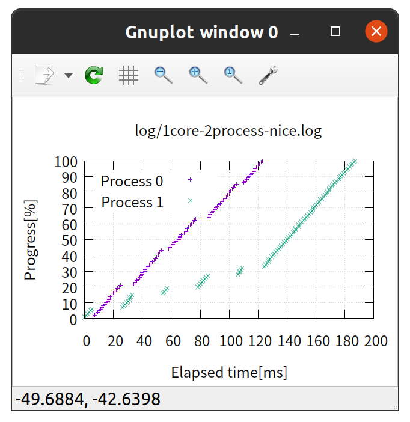
  

- 그림을 통해 우선순위가 높은 (nice 값이 작은) 프로세스의 CPU 점유 시간이 더 긴 것을 볼 수 있다.

### nice 명령어

- 우선순위 설정을 명령어로 수행할 수 있다.

- sar 명령어의 %nice 필드는 우선순위를 변경한 프로세스에 할당한 시간의 비율을 나타낸다.

  ```sh
  $ nice -n 5 python src/loop.py &
  [1] 7431
  $ sar -P ALL 1 1
  Linux 5.13.13-surface (ubun2-Surface-Pro-7)     2021년 09월 15일        _x86_64_        (8 CPU)

  00시 17분 00초     CPU     %user     %nice   %system   %iowait    %steal     %idle
  00시 17분 01초     all      2.00     12.50      0.62      0.12      0.00     84.75
  00시 17분 01초       0      2.00      0.00      2.00      0.00      0.00     96.00
  00시 17분 01초       1      0.00    100.00      0.00      0.00      0.00      0.00
  00시 17분 01초       2      1.98      0.00      1.98      0.00      0.00     96.04
  00시 17분 01초       3      3.00      0.00      0.00      0.00      0.00     97.00
  00시 17분 01초       4      3.00      0.00      0.00      1.00      0.00     96.00
  00시 17분 01초       5      2.00      0.00      0.00      0.00      0.00     98.00
  00시 17분 01초       6      2.02      0.00      0.00      0.00      0.00     97.98
  00시 17분 01초       7      2.00      0.00      1.00      0.00      0.00     97.00
  ...
  $ kill 7431
  [1]  + 7431 terminated  nice -n 5 python src/loop.py  
  ```

    - 코어1의 %nice 값이 100인 것을 볼 수 있다.
    
    - 우선순위 5로 작동되는 무한루프가 CPU1을 계속 점유하고 있음을 나타낸다.

---

### 참고

- [실습과 그림으로 배우는 리눅스 구조 - 타케우치 사토루](https://www.aladin.co.kr/shop/wproduct.aspx?ItemId=181554153)
